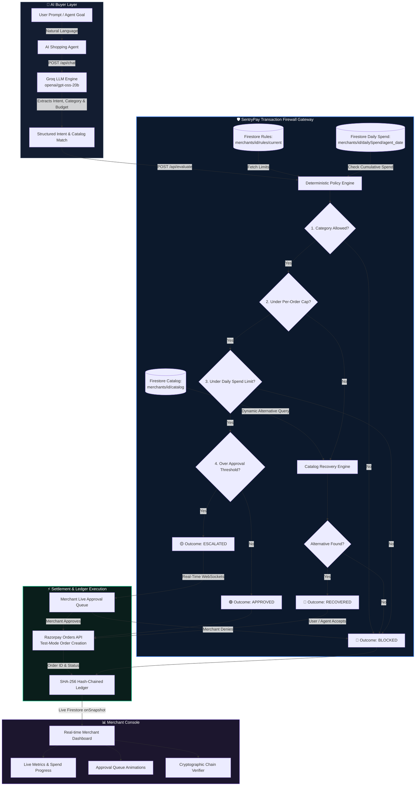

# 🛡️ SentryPay — AI Transaction Firewall & Agentic Gateway

<div align="center">

[](https://razorpay.com)
[](https://www.typescriptlang.org/)
[](https://reactjs.org/)
[](https://expressjs.com/)
[](https://firebase.google.com/)
[](https://groq.com)
[](https://razorpay.com/docs/api/orders/)
[](https://en.wikipedia.org/wiki/SHA-2)

<br/>

### **The Deterministic Policy & Governance Layer Between Autonomous AI Buyers and Your Razorpay Gateway.**

*Built for Razorpay's AI Growth & Agentic Commerce Hackathon*

[Explore Architecture](#-system-architecture) • [Policy Pipeline](#-decision-engine--5-stage-pipeline) • [The 4 Outcomes](#-the-four-governance-outcomes) • [Cryptographic Ledger](#-cryptographic-hash-chained-audit-trail) • [Getting Started](#-getting-started)

</div>

---

## 📌 Executive Summary

Autonomous AI agents (powered by LLMs, browser automation, and personal delegates) are beginning to shop and settle payments on behalf of consumers and businesses. However, traditional payment gateways are designed exclusively for **human checkouts**—relying on interactive browser sessions, manual form filling, and OTPs.

When an AI buyer agent attempts to transact directly with a merchant, three critical vulnerabilities emerge:
1. **Zero Policy Governance:** The merchant cannot restrict agent budgets, limits, or authorized merchandise categories.
2. **Binary Checkout Drop-off:** A single rule violation (such as an item being ₹50 over budget) causes a hard drop-off, permanently killing the sale.
3. **Absence of Proof & Auditability:** Merchants and users have no tamper-evident log explaining *who* the agent was, *why* a decision was made, or *which* policy allowed the transaction.

**SentryPay solves this as a middleware gateway.** It acts as an intelligent transaction firewall between any AI shopping agent and the Razorpay Orders API. Every purchase request is intercepted, identity-verified, policy-evaluated in strict sequence, and logged to a tamper-proof cryptographic ledger before a single rupee can move.

---

## 💡 What Makes SentryPay Revolutionary: The "Recovery" Paradigm

Traditional payment gateways and firewalls enforce binary logic: **APPROVE or BLOCK**.

In agentic commerce, flat rejections are catastrophic:
- If an agent wants to buy a premium product priced at **₹5,800**, but the merchant's per-order firewall cap is **₹5,000**, conventional systems simply reject the transaction. The buyer leaves, and the revenue is lost forever.

### 🔄 The SentryPay Recovery Engine
Instead of terminating the purchase, SentryPay dynamically activates **Recovery Mode**:
1. It queries the merchant's live Firestore catalog in real time.
2. It filters for in-budget alternatives under the **₹5,000** limit within the exact same category.
3. It identifies the highest-value matching item (e.g., a **₹4,899** alternative).
4. It issues a structured **Recovery Offer** back to the AI buyer agent.
5. Once accepted, the purchase executes seamlessly via Razorpay.

> **Result:** SentryPay transforms would-be blocked transactions into completed revenue while strictly maintaining merchant financial boundaries.

---

## 🏗️ System Architecture

The following diagram illustrates how an AI buyer agent request moves through SentryPay's pipeline:



---

## ⚙️ Decision Engine — 5-Stage Policy Pipeline

SentryPay evaluates purchase requests through a strictly ordered, deterministic pipeline:


### Evaluation Order & Rules

1. **Stage 1: Category Allow-List Verification**
   - Matches product's category against the merchant's permitted categories list (e.g., `["Electronics", "Fashion", "Home & Kitchen", "Groceries"]`).
   - If outside the allow-list: Immediate **HARD BLOCK** with a plain-language explanation.

2. **Stage 2: Per-Order Cap & Recovery Trigger**
   - Evaluates if requested amount exceeds `rules.maxOrderAmount`.
   - If exceeded: Queries the catalog for products in the same category where `price <= rules.maxOrderAmount`. Returns the closest matching alternative as a **RECOVERY OFFER**. If no alternative exists, marks as blocked.

3. **Stage 3: Real-Time Cumulative Daily Spend Limit**
   - Checks `merchants/{merchantId}/dailySpend/{agentId_YYYY-MM-DD}`.
   - If `todaySpent + requestedAmount > rules.dailySpendLimit`: Triggers **HARD BLOCK** to prevent runaway agent loops or treasury exhaustion.

4. **Stage 4: High-Value Human-in-the-Loop Threshold**
   - If `requestedAmount > rules.approvalThreshold`: Triggers **ESCALATION**.
   - Transaction document is created with status `pending`. Pushed in real time to the merchant's Approval Queue.

5. **Stage 5: Autonomous Approval & Settlement**
   - If all limits and thresholds pass: Triggers **APPROVE**.
   - Invokes Razorpay's test-mode Orders API, generates a genuine Razorpay order ID, updates daily spend, and appends the transaction to the SHA-256 audit chain.

---

## 🎯 The Four Governance Outcomes

Every incoming agent request concludes in one of four distinct outcomes:

| Outcome | Trigger Condition | System Action | UI Representation |
|:---:|---|---|---|
| <span style="color:#10b981">**APPROVE**</span> | Passes all policy checks, budget cap, daily limit, and threshold. | Automatically calls Razorpay Orders API, generates `order_xxx`, sets status `completed`, updates daily spend. | **Confirmation Card** with green badge, Razorpay Order ID, and amount. |
| <span style="color:#3b82f6">**RECOVER**</span> | Exceeds per-order cap, but an in-budget alternative exists in the catalog. | Queries Firestore catalog for closest matching product in the same category under the cap. | **Recovery Offer Card** displaying alternative product, price savings, and **[Accept]** / **[Decline]** buttons. |
| <span style="color:#f59e0b">**ESCALATE**</span> | Within hard limits, but exceeds human approval threshold. | Halts automatic execution, creates `pending` transaction document, pushes to live Approval Queue. | **Pending Approval Card** with pulsing live status indicator awaiting merchant review. |
| <span style="color:#ef4444">**BLOCK**</span> | Violates allowed category, exceeds daily limit, or no recovery alternative exists. | Transaction rejected outright, no payment attempted. Documents exact policy violated. | **Rejection Card** with red border, ban icon, and human-readable policy violation message. |

---

## 🔗 Cryptographic SHA-256 Hash-Chained Audit Trail

To satisfy enterprise compliance and regulatory auditability, SentryPay records every single transaction event into a **cryptographic hash chain** modeled after blockchain ledgers.

```
GENESIS BLOCK: 0000000000000000000000000000000000000000000000000000000000000000
      │
      ▼
┌────────────────────────────────────────────────────────┐
│ TRANSACTION #1                                         │
│ PrevHash: 0000000000000000000000000000000000000000...  │
│ Payload:  time|agent|product|amount|decision|reason    │
│ Hash:     a7c9f81d4e2b017835f8e6c431b9d408f623...     │
└────────────────────────────────────────────────────────┘
      │
      ▼
┌────────────────────────────────────────────────────────┐
│ TRANSACTION #2                                         │
│ PrevHash: a7c9f81d4e2b017835f8e6c431b9d408f623...     │
│ Payload:  time|agent|product|amount|decision|reason    │
│ Hash:     4d2091fbe398b0451a437de562c8201a91e0...     │
└────────────────────────────────────────────────────────┘
      │
      ▼
┌────────────────────────────────────────────────────────┐
│ TRANSACTION #3                                         │
│ PrevHash: 4d2091fbe398b0451a437de562c8201a91e0...     │
│ Payload:  time|agent|product|amount|decision|reason    │
│ Hash:     9f538e12d4a07c128475ba98ec65123901b8...     │
└────────────────────────────────────────────────────────┘
```

### Deterministic Payload Serialization
Every transaction is signed using the exact canonical formula:
$$\text{Payload} = \text{prevHash} \parallel \text{time} \parallel \text{agent} \parallel \text{product} \parallel \text{amount} \parallel \text{decision} \parallel \text{reason}$$
$$\text{Hash} = \text{SHA-256}(\text{Payload})$$

### 🔍 Real "Verify Chain" Engine
In the SentryPay merchant dashboard, the **Verify Chain** button does not simply display a static badge. It runs a live audit across the entire transaction collection:
1. Re-fetches the full chronological chain from Firestore starting from Genesis.
2. Validates that `block[n].prevHash === block[n-1].hash`.
3. Recalculates the SHA-256 digest in the browser using the Web Crypto API (`crypto.subtle.digest`).
4. If a single byte in any document (such as price, product, or reason) was tampered with, verification fails immediately, flagging the exact corrupted block ID.

---

## 🗄️ Firestore Data Model

The application uses a clean, normalized Firestore structure under the merchant document:

```
merchants/
└── demo_merchant/
    ├── rules/
    │   └── current
    ├── catalog/
    │   ├── prod_1
    │   ├── prod_2
    │   └── ... (10 products)
    ├── transactions/
    │   ├── txn_01
    │   ├── txn_02
    │   └── ...
    └── dailySpend/
        └── agt_live_7f3c9e_2026-09-04
```

### Schema Definitions

#### 1. Rules (`merchants/{id}/rules/current`)
```json
{
  "maxOrderAmount": 4000,
  "dailySpendLimit": 50000,
  "allowedCategories": ["Electronics", "Fashion", "Home & Kitchen", "Groceries"],
  "approvalThreshold": 3000,
  "maxDiscountPercent": 15,
  "updatedAt": "2026-09-04T18:20:00.000Z"
}
```

#### 2. Daily Spend (`merchants/{id}/dailySpend/{agentId_date}`)
```json
{
  "agentId": "agt_live_7f3c9e",
  "date": "2026-09-04",
  "amount": 7498,
  "count": 3,
  "updatedAt": "2026-09-04T18:24:00.000Z"
}
```

#### 3. Transaction (`merchants/{id}/transactions/{txnId}`)
```json
{
  "time": "2026-09-04T18:23:00.000Z",
  "agent": "agt_live_7f3c9e",
  "product": "Smart Fitness Watch",
  "amount": 2999,
  "decision": "approved",
  "reason": "Within all policy limits",
  "status": "completed",
  "orderId": "order_79ry9jmq7",
  "razorpayOrderId": "order_79ry9jmq7",
  "prevHash": "0000000000000000000000000000000000000000000000000000000000000000",
  "hash": "757c1e7c2a3fafd60e7c3e7215161c0d55b622b94ddb881e8023b7022be4fb47"
}
```

---

## 💻 Tech Stack

| Domain | Technology | Purpose |
|---|---|---|
| **Frontend UI** | React 18, Vite, TypeScript | Ultra-responsive Single Page Application |
| **Styling & Motion** | Tailwind CSS v4, Framer Motion | Fintech design system, micro-animations, exit transitions |
| **Icons** | Lucide React | Modern visual iconography |
| **Backend API** | Express.js, Node.js, `tsx` | Secure API gateway endpoints with hot reloading |
| **Database & Realtime** | Firebase Cloud Firestore | NoSQL document storage with real-time `onSnapshot` streaming |
| **LLM & Agent Intent** | Groq API (`openai/gpt-oss-20b`) | Sub-second extraction of intent, category, and catalog matching |
| **Payments** | Official `razorpay` Node SDK | Direct integration with Razorpay's Orders API |
| **Integrity & Security** | Web Crypto API & Node.js `crypto` | Tamper-evident SHA-256 ledger chaining and audit verification |

---

## 🌐 Protocol Alignment: The Future of Agentic Commerce

SentryPay is architected to align with the emerging open standards and mandates for AI-driven financial transactions:

- **Google AP2 (Agent Payment Protocol):** Compatible with cryptographically signed buyer intent mandates.
- **OpenAI / Stripe ACP (Agentic Commerce Protocol):** Implements the merchant-side policy boundary and structured checkout primitives.
- **x402 Protocol:** Designed for automated HTTP 402 payment requirements and machine-to-machine settlements.
- **NPCI UAP (Unified Agent Protocol for UPI India):** Matches the proposed Indian standards for delegated agent spending limits, human-in-the-loop approvals, and audit trail retention.

---

## 🚀 Getting Started

### Prerequisites
- Node.js 18+ (Node 20+ recommended)
- npm or pnpm
- (Optional) Razorpay Test Keys from [Razorpay Dashboard](https://dashboard.razorpay.com/app/keys)

### 1. Clone & Install
```bash
git clone https://github.com/KISHORE0709-LEO/razorpay-agent-gateway.git
cd razorpay-agent-gateway
npm install
```

### 2. Configure Environment Variables
Create or verify `.env` in the root and `backend/.env`:

```env
PORT=8080
GROQ_API_KEY=your_groq_api_key_here

# Optional: Real Razorpay Test Keys (defaults to test dummy if not set)
RAZORPAY_KEY_ID=rzp_test_yourKeyHere
RAZORPAY_KEY_SECRET=yourSecretHere
```

### 3. Seed Database
Seed your Firestore database with the demo merchant, firewall policies, initial daily spend document, and 10 realistic catalog items:

```bash
npx tsx scripts/seed-firestore.ts
```

### 4. Run Locally
Launch both frontend (Vite port 5173) and backend (Express port 8080) concurrently:

```bash
npm run dev
```

Visit **`http://localhost:5173`** in your browser.

---

## 🧪 Simulation & Testing Guide

Once inside the dashboard, simulate the 4 primary scenarios in the **AI Buyer** chat:

1. **Approved Purchase:**
   > *"Buy me wireless bluetooth earbuds under 2000"*  
   - Matches: *Wireless Bluetooth Earbuds (₹1,499)*
   - Result: Passes all limits &rarr; Creates Razorpay Order &rarr; Shows **Confirmation Card** with Order ID.

2. **Recovery Trigger:**
   > *"Buy noise cancelling headphones for 7999"*  
   - Matches: *Noise Cancelling Headphones (₹7,999)*
   - Result: Exceeds per-order cap (₹4,000) &rarr; Queries catalog &rarr; Offers *Smart Fitness Watch (₹2,999)* with **Accept** and **Decline** options.

3. **Escalation & Live Approval:**
   > *"Buy non-stick cookware set for 3499"*  
   - Matches: *Non-Stick Cookware Set (₹3,499)*
   - Result: Above approval threshold (₹3,000) &rarr; Routes to **Approval Queue**.
   - Action: Switch to the **Approval Queue** tab and click **Approve**. Watch the card animate out and see the AI Buyer chat update live without refresh!

4. **Hard Block:**
   > *"Buy luxury diamonds in Luxury category"*  
   - Result: Category unapproved or non-existent in catalog &rarr; Shows **Blocked Card** with clear violation reason.

5. **Verify Hash Chain:**
   - Navigate to the **Audit Trail** tab.
   - Click **Verify chain**.
   - Observe the real cryptographic SHA-256 verification of every block from genesis root.

---

## 👥 Contributors & License

- **Author:** Kishore ([@KISHORE0709-LEO](https://github.com/KISHORE0709-LEO))
- **Event:** Razorpay AI Growth & Agentic Commerce Hackathon
- **License:** MIT License

*Disclaimer: Built strictly for demonstration and hackathon evaluation. Test-mode payment tokens and sandbox environments are utilized; no real financial settlement is executed.*
