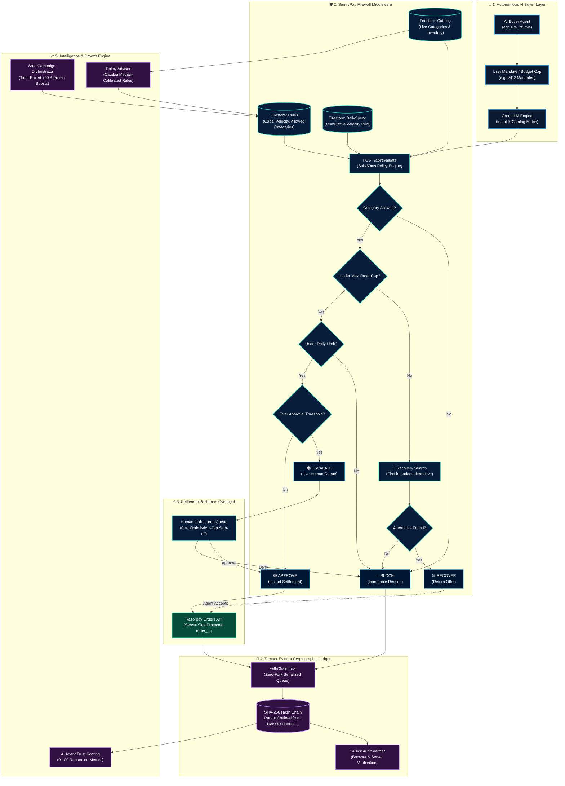

# 🛡️ SentryPay — AI Transaction Firewall & Agentic Gateway

<div align="center">

[](https://razorpay.com)
[](https://www.typescriptlang.org/)
[](https://reactjs.org/)
[](https://expressjs.com/)
[](https://firebase.google.com/)
[](https://groq.com)
[](https://razorpay.com/docs/api/orders/)
[](https://en.wikipedia.org/wiki/SHA-2)

<br/>

### **The Deterministic Policy, Recovery & Governance Gateway Between Autonomous AI Buyer Agents and Merchant Rails.**

*Built for Razorpay's AI Growth & Agentic Commerce Hackathon*

[Live Architecture](#-system-architecture) • [Decision Engine](#-the-4-way-governed-decision-engine) • [Key Features](#-key-features--capabilities) • [Cryptographic Ledger](#-cryptographic-sha-256-verdict-chain) • [Getting Started](#-getting-started) • [Meet the Developer](#-meet-the-developer)

</div>

---

## 📌 Executive Summary

Autonomous AI shopping agents—powered by LLMs, browser automations, and personal financial delegates—can now discover goods, negotiate terms, and attempt purchases autonomously. However, traditional payment gateways are designed strictly for **interactive human sessions** (relying on browser sessions, checkout redirects, and OTPs).

When an AI buyer agent attempts to transact directly with a merchant, three critical vulnerabilities emerge:
1. **Zero Policy Governance:** Merchants cannot limit per-order amounts, daily velocity pools, or authorized merchandise categories for non-human buyers.
2. **Binary Checkout Drop-off:** A single rule violation (such as an item priced ₹50 above an agent's ceiling) causes a hard drop-off, permanently killing merchant revenue.
3. **Absence of Proof & Auditability:** Neither merchants nor consumers have an audit-proof, tamper-evident log explaining *who* the agent was, *why* a verdict was rendered, or *which* policy allowed the transaction.

**SentryPay is the missing middleware layer.** It sits between any autonomous AI buyer agent and Razorpay. Every purchase request is intercepted, identity-verified, policy-evaluated in sub-50ms, and cryptographically sealed into a SHA-256 hash chain before a single rupee can move.

---

## 💡 The Core Innovation: "Smart Recovery" vs. Binary Rejections

Traditional gateways and firewalls enforce binary logic: **APPROVE or BLOCK**.

In agentic commerce, outright rejections destroy conversion:
- If an agent wants to buy headphones priced at **₹5,800**, but the merchant's per-order firewall cap is **₹5,000**, conventional systems simply reject the transaction. The buyer leaves, and the sale is lost forever.

```
┌──────────────────────────────────────────────────────────────────────────┐
│ Traditional Gateway:   ₹5,800 Request  ──►  [Cap: ₹5,000]  ──►  ❌ BLOCK  │
│ SentryPay Gateway:     ₹5,800 Request  ──►  [Cap: ₹5,000]  ──►  🔄 RECOVER│
│                        └── Suggests In-Budget ₹4,899 Item  ──►  ✅ SALE!  │
└──────────────────────────────────────────────────────────────────────────┘
```

### 🔄 How SentryPay Smart Recovery Works:
1. Intercepts the over-budget purchase request.
2. Queries the merchant's live Firestore catalog in real time.
3. Finds matching products within the **exact same category** where `price <= rules.maxOrderAmount`.
4. Identifies the closest in-budget alternative (e.g., a **₹4,899** alternative).
5. Returns a structured **Recovery Offer** with transparent savings details.
6. Once accepted, the purchase settles immediately via Razorpay.

---

## 🏗️ System Architecture



---

## 🎯 The 4-Way Governed Decision Engine

Every purchase request evaluated by SentryPay resolves into one of four deterministic outcomes:

| Outcome | Trigger Condition | System Action | Merchant Impact |
|:---:|---|---|---|
| <span style="color:#10b981;font-weight:bold">🟢 APPROVE</span> | Amount $\le$ Approval Threshold & All Limits Pass | Automatically calls Razorpay Orders API (`order_...`), commits transaction, and logs block hash. | **Zero Friction:** Instant automated revenue. |
| <span style="color:#f59e0b;font-weight:bold">🟡 RECOVER</span> | Amount $>$ Max Order Cap, but in-budget alternative exists in category | Queries live catalog, finds best alternative within budget, and returns structured recovery offer. | **Revenue Defense:** Converts would-be lost sales into closed orders. |
| <span style="color:#f97316;font-weight:bold">🟠 ESCALATE</span> | Approval Threshold $<$ Amount $\le$ Max Order Cap | Halts automated checkout, assigns `pending` status, and pushes to real-time human queue with agent trust score. | **Risk Control:** Protects against unexpected high-value agent orders. |
| <span style="color:#ef4444;font-weight:bold">🔴 BLOCK</span> | Disallowed category, daily limit exceeded, or no recovery match | Immediate hard stop. Logs immutable plain-text reason to the ledger without charging payment rails. | **Treasury Protection:** Prevents unauthorized spending and runaway loops. |

---

## 🚀 Key Features & Capabilities

### 1. 🛡️ 4-Way Policy Firewall (<50ms Engine)
- Deterministic sub-50ms rule evaluation against live merchant policies.
- Per-order caps, cumulative daily velocity limits, and approval thresholds.
- Enforces strict execution order to eliminate ambiguity.

### 2. 🔄 Smart Catalog Recovery Engine
- Dynamically queries merchant inventory when an agent exceeds price ceilings.
- Finds nearest alternative product in the exact same category matching budget.
- Returns structured JSON recovery offers that agents can accept programmatically.

### 3. 👥 Human-in-the-Loop Instant Approval Queue
- Zero-latency optimistic UI updates: approved/denied requests resolve in 0ms.
- Built-in error rollback guards ensure consistency if network operations fail.
- Displays buyer agent identity, historical reliability, and real-time trust scores.

### 4. 🔗 SHA-256 Cryptographic Verdict Chain
- Every approve, recover, escalate, block, and human decision is permanently hash-chained.
- Canonical payload serialization: `prevHash | time | agent | product | amount | decision | reason`.
- `withChainLock` atomic queue prevents chain forks during high-concurrency bursts.
- Interactive 1-click **Verify Chain** audits all hashes back to the genesis block (`000000...`).

### 5. 📦 Dynamic Catalog & Category Governance
- Categories are generated dynamically from current inventory—never hardcoded.
- Brand-new categories added to the catalog start **blocked by default** until explicitly approved.
- Live catalog stat cards compute price ranges, median prices, stock levels, and counts in real time.

### 6. 🧠 Autonomous AI Agent Trust Scoring
- Evaluates buyer agents with an adaptive 0–100 behavioral reputation score.
- Dynamic classification: `Flagged`, `Low`, `Neutral`, `Trusted`, and `Verified`.
- Increases scrutiny for untrusted agents while preserving merchant hard limits.

### 7. 📈 Safe Campaign Orchestrator
- Recommends autonomous, time-boxed marketing limit boosts (e.g. Flash Sales, Clearance).
- Enforces a strict **20% safety ceiling** above base rules to prevent runaway liability.
- Automatically expires; strictly isolates overrides without ever mutating base rules.
- Duplicate suppression ensures identical campaigns are not regenerated within 24 hours.

### 8. 💡 Intelligent Policy Advisor
- Computes calibrated rule recommendations using merchant's real catalog metrics.
- Generates 3 distinct strategies: **Conservative**, **Balanced**, and **Growth**.
- Automatically rounds caps to realistic transaction numbers based on catalog medians.

### 9. 🔒 Isolated Razorpay Rails
- Server-to-server Razorpay Orders API generation (`order_...`).
- AI agents never touch secret keys, payment processor credentials, or raw cards.
- Test-mode integration guarantees safe demonstrations without financial risk.

---

## 🔗 Cryptographic SHA-256 Verdict Chain

SentryPay records every transaction event into an immutable cryptographic hash chain modeled after blockchain ledgers:

```
GENESIS BLOCK: 0000000000000000000000000000000000000000000000000000000000000000
      │
      ▼
┌────────────────────────────────────────────────────────┐
│ BLOCK #1                                               │
│ PrevHash: 0000000000000000000000000000000000000000...  │
│ Payload:  time|agent|product|amount|decision|reason    │
│ Hash:     a7c9f81d4e2b017835f8e6c431b9d408f623...     │
└────────────────────────────────────────────────────────┘
      │
      ▼
┌────────────────────────────────────────────────────────┐
│ BLOCK #2                                               │
│ PrevHash: a7c9f81d4e2b017835f8e6c431b9d408f623...     │
│ Payload:  time|agent|product|amount|decision|reason    │
│ Hash:     4d2091fbe398b0451a437de562c8201a91e0...     │
└────────────────────────────────────────────────────────┘
      │
      ▼
┌────────────────────────────────────────────────────────┐
│ BLOCK #3                                               │
│ PrevHash: 4d2091fbe398b0451a437de562c8201a91e0...     │
│ Payload:  time|agent|product|amount|decision|reason    │
│ Hash:     9f538e12d4a07c128475ba98ec65123901b8...     │
└────────────────────────────────────────────────────────┘
```

### Deterministic Payload Serialization
Every block hash is computed canonically:
$$\text{Payload} = \text{prevHash} \parallel \text{time} \parallel \text{agent} \parallel \text{product} \parallel \text{amount} \parallel \text{decision} \parallel \text{reason}$$
$$\text{Hash} = \text{SHA-256}(\text{Payload})$$

---

## 💻 Tech Stack

| Domain | Technology | Purpose |
|---|---|---|
| **Frontend UI** | React 18, Vite, TypeScript | Ultra-responsive Single Page Application |
| **Styling & Motion** | TailwindCSS, Lucide React, Framer Motion | Fintech design system with dark luxury theme |
| **Backend API** | Express.js, Node.js, `tsx` | High-performance API gateway with hot reload |
| **Database & Realtime** | Firebase Cloud Firestore | NoSQL document storage with live `onSnapshot` streaming |
| **LLM & Agent Intent** | Groq API (`llama-3.3-70b-versatile`) | Sub-second extraction of intent, category, and budget |
| **Payments** | Official `razorpay` Node SDK | Server-side Razorpay Orders API generation |
| **Integrity & Security** | Web Crypto API & Node.js `crypto` | Tamper-evident SHA-256 ledger chaining & audit verification |

---

## 🌐 Protocol Alignment

SentryPay is designed to interoperate with emerging global and Indian agentic commerce standards:

- **Google AP2 (Agent Payment Protocol):** Compatible with cryptographically signed buyer intent mandates.
- **OpenAI / Stripe ACP (Agentic Commerce Protocol):** Merchant-side policy boundaries and structured checkout primitives.
- **x402 Protocol:** Supports machine-to-machine HTTP 402 payment requirements.
- **NPCI Delegated UPI Spend:** Aligns with Indian standards for autonomous agent spending limits and human-in-the-loop oversight.

---

## 🚀 Getting Started

### Prerequisites
- Node.js 18+ (Node 20+ recommended)
- npm or pnpm
- (Optional) Razorpay Test Keys from [Razorpay Dashboard](https://dashboard.razorpay.com/app/keys)

### 1. Clone & Install
```bash
git clone https://github.com/KISHORE0709-LEO/razorpay-agent-gateway.git
cd razorpay-agent-gateway
npm install
```

### 2. Configure Environment Variables
Create or verify `.env` in the root and `backend/.env`:

```env
PORT=8080
GROQ_API_KEY=your_groq_api_key_here

# Optional: Razorpay Test Keys (defaults to sandbox if unset)
RAZORPAY_KEY_ID=rzp_test_yourKeyHere
RAZORPAY_KEY_SECRET=yourSecretHere
```

### 3. Seed Database
Seed your Firestore database with the demo merchant, firewall policies, initial daily spend counter, and catalog items:

```bash
npx tsx scripts/seed-firestore.ts
```

### 4. Run Locally
Launch frontend (Vite port 5173) and backend (Express port 8080) concurrently:

```bash
npm run dev
```

Open **`http://localhost:5173`** in your browser.

---

## 🧪 Interactive Testing Guide

In the **AI Buyer** simulator, test all 4 outcomes and advanced features:

1. **🟢 Approved Purchase:**
   > *"Buy wireless bluetooth earbuds under 2000"*  
   - Matches: *Wireless Bluetooth Earbuds (₹1,499)*
   - Result: Passes all limits ➔ Creates Razorpay Order (`order_...`) ➔ Logs to Verdict Chain.

2. **🟡 Smart Recovery:**
   > *"Buy noise cancelling headphones for 7999"*  
   - Matches: *Noise Cancelling Headphones (₹7,999)*
   - Result: Exceeds per-order cap (₹4,000) ➔ Searches catalog ➔ Offers *Smart Fitness Watch (₹2,999)* with **Accept** and **Decline** options.

3. **🟠 Escalation & 1-Tap Queue Approval:**
   > *"Buy non-stick cookware set for 3499"*  
   - Matches: *Non-Stick Cookware Set (₹3,499)*
   - Result: Above approval threshold (₹3,000) ➔ Escalate to **Approval Queue**.
   - Action: Switch to the **Approval Queue** tab and click **Approve**. Watch the optimistic UI update instantly and see the AI Buyer chat resolve live!

4. **🔴 Hard Policy Block:**
   > *"Buy luxury diamonds in Luxury category"*  
   - Result: Category unapproved ➔ Blocked with immutable plain-language reason.

5. **🔍 Verify Cryptographic Hash Chain:**
   - Navigate to the **Verdict Chain** tab and click **Verify chain**.
   - The browser recalculates every SHA-256 block hash from genesis root to confirm zero tampering.

6. **💡 Test Policy Advisor:**
   - Go to **Firewall Rules** ➔ Click **Open Policy Advisor**.
   - View 3 calibrated strategies (Conservative, Balanced, Growth) computed directly from real catalog prices and transaction statistics.

---

## 👨‍💻 Meet the Developer

<div align="center">

### **M KISHORE**
**Full-Stack & AI Systems Developer**

Passionate about building resilient, high-performance web applications with Next.js, TypeScript, React, and modern cloud databases.

[](https://github.com/KISHORE0709-LEO)
[](https://linkedin.com)
[](https://github.com/KISHORE0709-LEO/razorpay-agent-gateway)

```
Tech Stack: Next.js 16 • TypeScript • React • Firebase Firestore • TailwindCSS • Node.js • Razorpay SDK
```

</div>

---

## 📄 License

Built with ❤️ by M Kishore for the **Razorpay AI Growth & Agentic Commerce Hackathon**.  
Licensed under the [MIT License](LICENSE).
